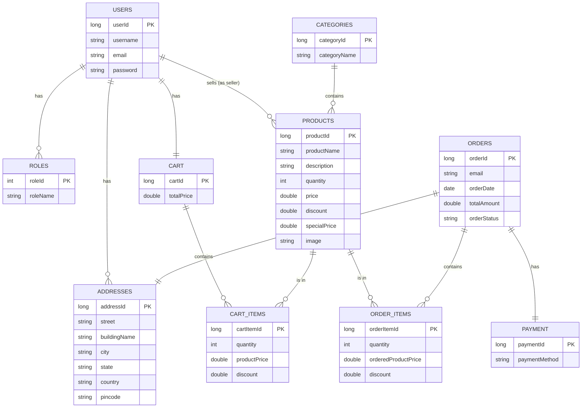

# Database Schema

The **Bazar** database is designed to support a full-featured e-commerce application. Below is the Entity-Relationship (ER) diagram and description of the key tables.

## ER Diagram

## Entity Descriptions

### User Management
- **USERS**: Stores user credentials and profile information.
- **ROLES**: Defines user roles (e.g., `ROLE_USER`, `ROLE_ADMIN`).
- **ADDRESSES**: Stores shipping/billing addresses associated with users.

### Product Catalog
- **CATEGORIES**: Hierarchical organization of products (e.g., Electronics, Books).
- **PRODUCTS**: The core items for sale. Contains pricing, stock, and descriptions. Linked to a Category and a Seller (User).

### Shopping & Orders
- **CART**: Represents a user's shopping cart. One-to-one relationship with User.
- **CART_ITEMS**: Represents individual items within a cart, linking a Product to a Cart with a specific quantity.
- **ORDERS**: Represents a finalized purchase. Linked to a shipping Address and Payment.
- **ORDER_ITEMS**: A snapshot of the products at the time of purchase (price, discount, quantity).
- **PAYMENT**: Stores payment method details for an order.
